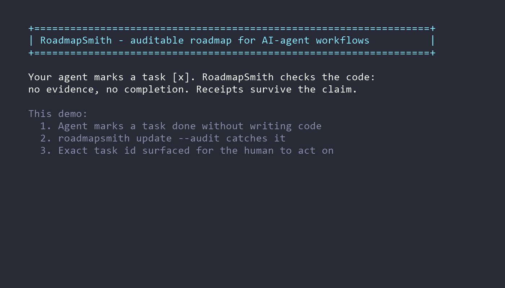

<p align="center">
  
</p>

<h1 align="center">RoadmapSmith</h1>

<p align="center">
  Evidence-backed ROADMAP.md generator and sync tool for AI coding agents.
</p>

Turn vague software ideas into deterministic, evidence-trackable roadmaps for AI coding agents — then keep them honest with repository-backed validation.

[](https://www.npmjs.com/package/roadmapsmith)
[](https://opensource.org/licenses/MIT)
[](https://nodejs.org/)

## Quick Start

```bash
npm install -g roadmapsmith
roadmapsmith setup
roadmapsmith zero       # Empty repo: interview + init + generate
roadmapsmith maintain   # Existing repo: generate + sync + audit
```

In VS Code, run `Tasks: Run Task` and start with `RoadmapSmith: Status`, then use `RoadmapSmith: Zero Mode` for empty repos or `RoadmapSmith: Maintain` for existing repos.
The generated task layer now resolves Node automatically where possible; if it cannot, RoadmapSmith prints a readable runtime diagnostic instead of a dead task.
`RoadmapSmith: Status` now treats "ready" as runnable task UX, not merely generated files.
You can also use slash entrypoints such as `roadmapsmith /roadmap`, `roadmapsmith /roadmap-zero`, `roadmapsmith /roadmap-maintain`, `roadmapsmith /roadmap-update`, or the deprecated legacy router form `roadmapsmith /roadmap-sync validate`.

Optional Claude Code skill bundle:

```bash
npx skills add PapiScholz/roadmapsmith --skill '*' -a claude-code
```

This is the recommended install path if you want native Claude GUI slash commands such as `/roadmap`, `/roadmap-zero`, `/roadmap-maintain`, `/roadmap-status`, `/roadmap-init`, `/roadmap-generate`, `/roadmap-validate`, `/roadmap-update`, `/roadmap-audit`, and `/roadmap-setup`.
`roadmap-sync` is deprecated compatibility only; install the full bundle for new workflows and use `/roadmap-maintain` or `/roadmap-update`.
The skills guide the agent. The CLI executes actions. `roadmapsmith setup` makes those actions visible in VS Code, generates per-platform task wrappers, and can also wire the repo-local Claude hook, but it does not create native Claude GUI slash commands by itself.
The published RoadmapSmith package/plugin surface now ships the same shared bundle files (`skills.json`, `skills/*`, `.codex-plugin/plugin.json`, `.claude-plugin/plugin.json`) as the GitHub-source install path, but consuming the CLI alone still does not auto-register native Codex or Claude GUI commands.

Optional Codex native plugin surface from this checkout:

```bash
codex plugin marketplace add .
```

Then restart Codex, open the plugin directory, and install `roadmapsmith` from the `RoadmapSmith Local Plugins` marketplace. That native Codex surface uses the same shared `skills/` bundle as Claude, but it is a separate host contract from Claude's `/reload-skills` flow.

## Demo

RoadmapSmith marks tasks complete only after repository evidence exists.



No manual checkboxes. No hallucinated progress. Only verifiable completion.

---

## What Problem This Solves

AI coding agents operate in sessions — they lose context, rely on self-reported completion, and have no external validation anchor. Without a grounding mechanism, a task marked `[x]` means only that the model decided it was done. RoadmapSmith addresses three compounding problems:

**Hallucinated completion.** Agents claim task completion without traceable evidence in code, tests, or artifacts. RoadmapSmith validates completion against repository state — not the agent's self-assessment.

**Roadmap drift.** Generated roadmaps go stale as the project evolves. The `generate` and `sync` commands reconcile the roadmap from actual repository context while preserving substantive managed content by default; `regenerate` is the explicit full rebuild path when you intentionally want to replace the managed block.

**Session discontinuity.** Multi-session agent workflows lose progress context between sessions. `ROADMAP.md` serves as a durable, inspectable state file that any session can read, trust, and extend — without relying on conversation history.

---

## What Makes This Different

| | RoadmapSmith | TODO list | Jira | Naive agent workflow |
|---|---|---|---|---|
| Grounded in repository state | ✓ | ✗ | ✗ | ✗ |
| Detects hallucinated completion | ✓ | ✗ | ✗ | ✗ |
| Deterministic generation | ✓ | ✗ | ✗ | ✗ |
| Zero production dependencies | ✓ | — | ✗ | — |
| Multi-session compatible | ✓ | varies | ✓ | varies |

TODO lists track intent. Jira tracks human-managed status. Neither validates that code actually changed. A naive agent workflow trusts the model's output — which means accepting hallucinations as ground truth.

RoadmapSmith introduces a third path: **validation by evidence**. Before `sync` marks a task complete, the validator runs a multi-pass evidence scan: explicit file paths mentioned in the task text → symbol names → code token matching → test file matching → artifact presence (README, CHANGELOG, docs/, dist/). The model's claim is one input; the repository is the authority.

---

## How It Works

```
roadmapsmith setup             # Create visible VS Code tasks + optional Claude hook wiring
roadmapsmith zero              # Empty repo: terminal interview + init + generate
roadmapsmith maintain          # Existing repo: generate + sync + audit
roadmapsmith update --task <id> --evidence "<code-and-test paths>"  # Complete one verified task
roadmapsmith init              # Advanced/manual: write ROADMAP.md + AGENTS.md governance files
roadmapsmith generate          # Advanced/manual: preserve-first roadmap update from repository context
roadmapsmith generate --full-regen # Advanced/manual: explicit full managed-block rebuild
roadmapsmith validate --json   # Advanced/manual: check task completion against evidence
roadmapsmith sync              # Advanced/manual: apply validation results (mark ✓ or warn ⚠️)
```

The primary contract is now one command per mode: `zero` for empty repos, `maintain` for existing repos. The lower-level commands remain available for manual control. `setup` is the editor-host bridge: it creates visible VS Code tasks for Codex/manual workflows, generates per-platform task wrappers that resolve Node automatically, and can wire the Claude `PostToolUse` hook. Slash routing adds a discovery layer on top: `/roadmap` shows the RoadmapSmith palette, exact slash commands execute, and incomplete or ambiguous input only shows suggestions. Today `sync --audit` is best treated as a mutating sync plus summary, not as a dedicated read-only audit gate.

### Slash Invocation

```bash
roadmapsmith /roadmap
roadmapsmith /roadmap-zero
roadmapsmith /roadmap-maintain
roadmapsmith /roadmap-update
roadmapsmith /roadmap-sync validate
```

- `/roadmap` is the palette/help entrypoint.
- Exact slash commands execute normally.
- Partial or ambiguous input shows suggestions only; it never writes files by accident.

**`generate`** indexes your repository for languages, test frameworks, modules in `src/`, `lib/`, `packages/`, and TODO/FIXME markers (up to 120 files). On an existing substantive managed block it preserves task text, language, prose, Evidence lines, and headings in place, then appends only unmatched generated items under `RoadmapSmith Additions`. Task IDs are stable via `<!-- rs:task=id -->` markers.

**`regenerate`** is the explicit destructive path. Use it only when you intentionally want to rebuild the managed block from repository context and replace preserved domain content.

**`validate`** runs the multi-pass evidence scan. Each task is scored against: backtick-quoted paths in task text, symbol names, code token matching (threshold: 2+ matches for multi-token tasks), test file matching, and artifact presence. Results include the reason a task passed or failed.

**`sync`** writes only within a `<!-- rs:managed:start/end -->` block, leaving the rest of your `ROADMAP.md` untouched. It marks passing tasks `[x]` and appends warning lines for failing ones: `⚠️ attempted but validation failed: <reason>` when there is concrete attempt evidence, or `⚠️ no implementation evidence found yet: <reason>` when there is not. `sync --audit` currently runs that same mutation path and then prints a mismatch summary; it is not yet a separate read-only audit mode.

## Host Support Today

| Host | Current support |
|---|---|
| Claude Code | Supported through the full RoadmapSmith skill bundle for native GUI slash commands (`/roadmap`, `/roadmap-zero`, `/roadmap-maintain`, etc.), plus `roadmapsmith setup` for visible VS Code tasks and the optional repo-local Claude hook. |
| Codex / Codex CLI | Supported through the native Codex plugin surface (`.codex-plugin/plugin.json` + repo marketplace) and the visible VS Code task workflow after `roadmapsmith setup`. |
| CI | Usable in disposable checkouts, but `sync --audit` is still mutating. |
| Other hosts | Use the skill instructions plus manual `generate`, `validate`, `sync`, and `sync --dry-run` commands. |

Claude write-time autoupdate depends on the host environment being able to resolve `node` for the repo-local hook. VS Code tasks use generated wrappers and can also honor `ROADMAPSMITH_NODE` when PATH-based Node resolution is unreliable. That best-effort hook is separate from this repository's git `pre-commit` sync behavior. Native Claude GUI slash commands come from the installed RoadmapSmith skill bundle; native Codex plugin install comes from `.codex-plugin/plugin.json` plus a marketplace entry; CLI slash routing (`roadmapsmith /roadmap`, `roadmapsmith /roadmap maintain`, and deprecated short aliases) is a separate surface that remains available in terminals and launchers. The published package now mirrors that same bundle on disk for downstream host loaders, but each host still has to load its own surface before the GUI changes.

Windows note: prefer `roadmapsmith.cmd`, `npm.cmd`, or explicit `node` paths in shells where PowerShell execution policy or PATH resolution differs from `cmd.exe`. If the globally installed shim fails because `node` is absent from that shell PATH, bypass the npm shim:

```powershell
& "C:\Program Files\nodejs\node.exe" "$env:APPDATA\npm\node_modules\roadmapsmith\bin\cli.js" <command>
```

---

## Two Operating Modes

### Zero Mode: Start from an empty repository

Use this when you have:

- A new or empty repository
- A vague product idea with no implementation files
- No stack decision yet
- No ROADMAP.md yet

Expected agent behavior:

- Do not immediately generate a generic roadmap.
- First run a discovery conversation to define the product brief.
- Define the product north star, target user, and problem statement.
- Recommend or confirm stack after understanding constraints.
- Define the v1.0 outcome, anti-goals, and risks.
- Generate ROADMAP.md as the execution contract.

`roadmapsmith zero` is the public entrypoint for this mode. It runs the terminal interview, persists the brief into config, creates governance files when needed, and generates the first roadmap in one invocation.

Discovery questions asked by the CLI interview:

1. What product are we building?
2. Who is the target user?
3. What problem does it solve?
4. What is the desired v1.0 outcome?
5. What is explicitly out of scope?
6. What stack do you prefer, if any?
7. What constraints exist? (Budget, hosting, compliance, platform, deadline.)
8. What does "done" mean for the first usable version?

Recommended workflow:

```bash
roadmapsmith zero
```

Optional policy layer:

```bash
npx skills add PapiScholz/roadmapsmith --skill roadmap-sync
```

The CLI executes the one-command workflow. The `roadmap-sync` skill remains the agent policy/governance layer for hosts that use skills. For native Claude GUI slash commands, install the full Claude bundle instead of only `roadmap-sync`.

---

### Sync/Audit Mode: Keep an existing roadmap honest

Use this when your repository already has code, tests, docs, TODOs, or an existing ROADMAP.md.

Expected behavior:

- Scan repository context: detect languages, modules, commands, test frameworks, TODO/FIXME markers.
- Generate or update the managed roadmap block.
- Validate tasks against repository evidence.
- Sync checklist state.
- Audit mismatches.

Recommended workflow:

```bash
roadmapsmith maintain
```

`maintain` runs `generate + sync + audit` in one invocation. After it succeeds, do not run generate, sync, or audit again in the same cycle unless you need manual inspection or tighter control.

---

## Roadmap Profiles

RoadmapSmith supports multiple output profiles. Set `roadmapProfile` in `roadmap-skill.config.json`:

| Profile | Description | Status |
|---|---|---|
| `compact` | Checklist-style output grouped by phase (P0/P1/P2). Default. Backward compatible. | Stable |
| `professional` | 12-section roadmap with Phase → Step → Task hierarchy and task-level priority labels. | Stable |
| `enterprise` | Extended profile with additional governance sections. | Planned |

### Selecting a profile

```json
{
  "roadmapProfile": "professional",
  "product": {
    "name": "My Project",
    "northStar": "One sentence that describes the product mission.",
    "positioning": "What makes this different from alternatives.",
    "primaryUser": "Who uses this and in what context.",
    "targetOutcome": "What success looks like for the user.",
    "antiGoals": ["Things this product will never do"],
    "risks": ["Known risks to delivery or adoption"],
    "successCriteria": ["Measurable criteria for v1.0"],
    "phases": [
      {
        "phaseNumber": 1, "title": "Foundation", "priority": "P0",
        "objective": "Establish a baseline.",
        "steps": [{
          "stepNumber": 1, "title": "Core Setup", "priority": "P0",
          "dependsOn": [], "objective": "Close critical path items.",
          "tasks": [
            { "id": "prof-task-setup-ci", "text": "Set up CI pipeline", "priority": "P0" },
            { "id": "prof-task-add-tests", "text": "Add automated tests", "priority": "P1" }
          ],
          "exitCriteria": [{ "text": "CI green on main", "priority": "P0" }],
          "risks": []
        }]
      }
    ]
  }
}
```

`product.phases` is optional — if omitted, phases are inferred from P0/P1/P2 task groups. Priority at every level (phase, step, task) is a display label only. Phases and steps always sort by number, never by priority.

**Supported priority labels:** `P0` (critical), `P1` (high), `P2` (normal), `P3` (later/backlog). All are valid at phase, step, and task level. In dedup resolution, lower numbers win; `P3` items are deprioritized but never silently upgraded.

**`customPhases`** — top-level config key (sibling to `roadmapProfile`, outside `product`) that overrides inferred phase groups with explicit structure:

```json
{
  "customPhases": [
    {
      "phaseNumber": 4,
      "title": "Launch Preparation",
      "priority": "P1",
      "objective": "Prepare the project for public release.",
      "steps": [
        {
          "stepNumber": 1,
          "title": "Repository Polish",
          "priority": "P1",
          "dependsOn": [3],
          "tasks": [
            { "id": "mkt-add-demo", "text": "Add demo.gif or README placeholder", "priority": "P1" }
          ]
        }
      ]
    }
  ]
}
```

Set `validation.minimumConfidence` to suppress low-confidence results in CI:

```json
{
  "validation": { "minimumConfidence": "medium" }
}
```

Task markers can include `rs:no-test` to disable the test-evidence requirement for one task:

```markdown
- [ ] Add Windows autostart script <!-- rs:task=p0-windows-autostart rs:no-test -->
```

Validator rules are backward compatible and support optional overrides:

```json
{
  "validators": [
    { "when": "electron", "type": "grant-evidence", "evidence": ["code", "test"] },
    { "whenId": "^p0-electron-builder-windows$", "type": "grant-evidence", "evidence": ["test"], "testFiles": ["test/electron-builder.test.js"] },
    { "when": "legacy", "type": "file-exists", "path": "docs/legacy-notes.md", "overrideResult": true }
  ]
}
```

- `when` matches task text.
- `whenId` matches the stable `rs:task` ID.
- `grant-evidence` can grant `code`, `test`, or `artifact` evidence without `overrideResult`.
- Tests that read a referenced file with `fs.readFileSync`, `fs.readFile`, `readFileSync`, or `readFile` can count as test evidence for tasks that explicitly mention that file.

### Professional profile output example

This repository's own `ROADMAP.md` is generated with RoadmapSmith using the `professional` profile. Here is an excerpt from Section 4:

```markdown
## 4. Phased Execution Roadmap

### Phase 1: Product Architecture
**Phase Priority:** `[P1]`
**Objective:** Establish the renderer architecture and model hierarchy.

#### Step 1.2: Model Improvements
**Step Priority:** `[P0]`   ← P0 priority inside a P1 phase; renders second (stepNumber=2)
**Depends on:** None

**Tasks:**
- [ ] `[P0]` Add phasesDetailed model field <!-- rs:task=prof-task-add-phasesdetailed-model-field -->
- [ ] `[P1]` Filter code vs doc TODOs       <!-- rs:task=prof-task-filter-code-vs-doc-todos -->

**Exit Criteria:**
- [ ] `[P0]` A P0 task in a P2 step renders with [P0] label in correct position <!-- rs:task=prof-ph1-st2-exit-... -->
```

## When to use RoadmapSmith

Use RoadmapSmith when:

- You work with AI coding agents across multiple sessions
- Your project roadmap gets outdated quickly
- Agents complete tasks but forget to update documentation
- You need visible progress by phases, priorities, and releases
- You want completed checklist items backed by repository evidence

Do not use it if:

- Your project is a one-file script
- You do not use roadmaps or agent workflows
- You only need a static TODO list

## Commands

| Command | Purpose |
|---|---|
| `roadmapsmith setup` | Generate visible VS Code tasks, per-platform task wrappers, and optional Claude hook wiring |
| `roadmapsmith zero` | Run the Zero Mode interview and generate the first roadmap in one command |
| `roadmapsmith maintain` | Run the default existing-repo flow: generate, sync, and audit in one command |
| `roadmapsmith /roadmap` | Show the RoadmapSmith slash palette and related actions |
| `roadmapsmith /roadmap-zero` | Native slash alias for Zero Mode |
| `roadmapsmith /roadmap-maintain` | Native slash alias for the default existing-repo flow |
| `roadmapsmith /roadmap-update` | Native slash alias for applying evidence-backed sync |
| `roadmapsmith update --task <id> --evidence <text>` | Complete one task only after supplied evidence validates at high confidence |
| `roadmapsmith /roadmap-sync validate` | Execute the deprecated legacy namespaced root form through the router |
| `roadmapsmith init` | Create `ROADMAP.md` and `AGENTS.md` governance files |
| `roadmapsmith generate --project-root .` | Preserve-first roadmap update from repository context |
| `roadmapsmith generate --project-root . --full-regen` | Explicit full managed-block rebuild |
| `roadmapsmith validate --json` | Validate roadmap task evidence and emit JSON results |
| `roadmapsmith sync --audit` | Apply sync and print a mismatch summary; currently mutates `ROADMAP.md` |
| `roadmapsmith status --json` | Check repository plus host readiness, plus native slash surfaces for `claudeGui`, `claudeCli`, `codexGui`, and `codexCli` |
| `roadmapsmith doctor --json` | Compatibility alias for `roadmapsmith status --json` |
| `npx skills add PapiScholz/roadmapsmith --skill '*' -a claude-code` | Install the full Claude GUI skill bundle with native slash commands |
| `npx skills add PapiScholz/roadmapsmith --skill roadmap-sync` | Install only the legacy `/roadmap-sync` skill |

## Install: Claude Code Skill Bundle

### skills.sh and agentskill.sh

```bash
npx skills add PapiScholz/roadmapsmith --skill '*' -a claude-code
```

This is the recommended Claude Code install path. It exposes the full native GUI command set:

- `/roadmap`
- `/roadmap-zero`
- `/roadmap-maintain`
- `/roadmap-status`
- `/roadmap-init`
- `/roadmap-generate`
- `/roadmap-validate`
- `/roadmap-update`
- `/roadmap-audit`
- `/roadmap-setup`

After installing or updating the bundle, run `/reload-skills`. If you installed RoadmapSmith through a Claude plugin, also run `/reload-plugins` in the current session.

Compatibility path:

```bash
npx skills add PapiScholz/roadmapsmith --skill roadmap-sync
```

That installs only the legacy `/roadmap-sync` skill. It does not install the CLI and it does not create visible VS Code actions by itself.

### aitmpl.com/skills

Search for `roadmapsmith` on [aitmpl.com/skills](https://aitmpl.com/skills) and follow the install prompt, or install directly using the skills CLI above.

## Install: CLI + VS Code Host UX

```bash
npm install -g roadmapsmith
roadmapsmith setup
```

Then, inside VS Code:

1. Run `Tasks: Run Task`
2. Choose `RoadmapSmith: Status`
3. Use `RoadmapSmith: Zero Mode` for empty repos or `RoadmapSmith: Maintain` for existing repos
4. Use `Init`, `Generate`, `Validate`, and `Sync` only when you want manual control
5. Or invoke slash commands from CLI or launcher, starting with `/roadmap`

### VS Code / Codex quick start

```bash
npm install -g roadmapsmith
roadmapsmith setup
```

Codex can now load RoadmapSmith natively through the plugin directory. If you are not using that plugin surface, the supported fallback is still the generated VS Code task list plus the launcher slash router.
If Node is installed outside PATH, set `ROADMAPSMITH_NODE` to a working `node` executable and rerun `RoadmapSmith: Status`.
If the host is not loading the native plugin surface, the supported fallback is the CLI/launcher slash router plus VS Code tasks.

Recommended commands:

```bash
roadmapsmith zero
roadmapsmith maintain
roadmapsmith /roadmap
```

### Claude Code quick start

```bash
npm install -g roadmapsmith
roadmapsmith setup --hosts codex,claude
npx skills add PapiScholz/roadmapsmith --skill '*' -a claude-code
roadmapsmith zero
```

Then, in Claude Code:

1. Run `/reload-skills`
2. If RoadmapSmith was installed through a Claude plugin, also run `/reload-plugins`
3. Confirm the slash menu shows `/roadmap`, `/roadmap-zero`, `/roadmap-maintain`, `/roadmap-status`, `/roadmap-init`, `/roadmap-generate`, `/roadmap-validate`, `/roadmap-update`, `/roadmap-audit`, and `/roadmap-setup`

Native Claude GUI slash commands come from the installed skill bundle. CLI slash routing such as `roadmapsmith /roadmap` remains available in terminals and launchers, but it does not by itself populate the Claude GUI slash menu. The packed npm artifact now mirrors that same bundle for downstream host installers that do not fetch directly from a GitHub checkout.

## Install: Codex Native Plugin

RoadmapSmith now exposes a native Codex plugin manifest at `.codex-plugin/plugin.json` plus a repo-local marketplace entry at `.agents/plugins/marketplace.json`.

From the repository root:

```bash
codex plugin marketplace add .
```

Then restart Codex, open the plugin directory, install `roadmapsmith` from the `RoadmapSmith Local Plugins` marketplace, and confirm the plugin resolves the shared `./skills/` bundle.

Codex native support means plugin install and enablement inside Codex. It does not reuse Claude's `/reload-skills` flow. If you are not using the plugin directory, the supported fallback remains `roadmapsmith setup` plus the VS Code task and launcher workflow.

`roadmapsmith status --json` now separates native surfaces from the repo-local task layer (`doctor --json` remains a compatibility alias):

- `claudeGui`
- `claudeCli`
- `codexGui`
- `codexCli`

Each surface reports the detected source, expected slash commands, missing commands, and any duplicates such as a second `/roadmap-sync` coming from a legacy skill install.

If Codex shows `Roadmap Sync` twice, the usual cause is that both of these are installed at once:

- the legacy user skill at `~/.agents/skills/roadmap-sync`
- the full `roadmapsmith` Codex plugin

In that case `doctor` warns about the duplicate, and the fix is to remove or disable the legacy standalone skill if you want a single `/roadmap-sync` entry.

## Updating RoadmapSmith

Update the CLI based on how it was installed:

```bash
# Global npm install
npm install -g roadmapsmith@latest

# Project dependency
npm install roadmapsmith@latest

# One-off execution without installing
npx roadmapsmith@latest sync --audit
```

The RoadmapSmith Claude skill bundle is separate from the CLI. Re-running a skills install updates the Claude-facing instructions, but it does not update the `roadmapsmith` npm binary or the generated VS Code host files:

```bash
npx skills add PapiScholz/roadmapsmith --skill '*' -a claude-code
```

After updating the Claude skill bundle, run `/reload-skills` and, if applicable, `/reload-plugins`.
After updating the CLI, rerun `roadmapsmith setup` in repositories where you want the latest VS Code tasks, launcher behavior, or Claude hook template. Published npm/plugin artifacts now include the Codex and Claude bundle files for downstream host loaders, but native GUI visibility still depends on the host loading the correct surface.

Fixes are available through `@latest` after the automated release path completes on `main`. In this repo, a successful push to `main` now opens or refreshes an automated release PR, that PR merges back as the bot release commit, and the follow-up `main` run publishes the new patch version. Before that completes, install from a local checkout or a packed tarball for testing:

```bash
npm install C:\Users\ezesc\Github\roadmapsmith\roadmap-skill
```

## Local Development

```bash
cd roadmap-skill
npm install
npm test
npm run validate:qa-regression
npm run validate:functional-smoke
node bin/cli.js --help
node bin/cli.js init --dry-run
node bin/cli.js generate --project-root . --dry-run --audit
node bin/cli.js validate --json
```

If `npm test` fails in your shell with "`node` is not recognized", treat that as a local PATH/runtime issue first and rerun the suite with an explicit Node executable.

Before any `push` from this repository, the default gate is now two independent validation passes:

- `QA/Regression`: `npm run validate:qa-regression`
- `Functional/Smoke`: `npm run validate:functional-smoke`

Treat those as separate subagent-owned checks. Do not push until both passes are green and their findings have been reconciled in the main working tree.

## Release Readiness

Release and publication notes now live in:

- [docs/release-readiness.md](docs/release-readiness.md)
- [docs/release-ux-gate.md](docs/release-ux-gate.md)

Before merging to `main`, the docs, changelog placeholder, CLI help, slash routing, and VS Code task surface should all agree on the same public contract:

- `roadmapsmith setup`
- `roadmapsmith zero`
- `roadmapsmith maintain`
- native Codex plugin install/enable
- optional `roadmap-sync` skill as policy layer

## Naming Model

- RoadmapSmith: project/product name.
- roadmap-sync: installable agent skill name.
- roadmapsmith: optional CLI package and preferred command.
- roadmap-skill/: npm package directory.

## Repository Layout

```text
roadmapsmith/
├── README.md
├── AGENTS.md
├── ROADMAP.md
├── CHANGELOG.md
├── skills.json
├── skills/
│   └── roadmap-sync/
│       └── SKILL.md
├── .codex-plugin/
│   └── plugin.json
├── .claude-plugin/
│   └── plugin.json
├── .agents/
│   └── plugins/
│       └── marketplace.json
└── roadmap-skill/
    ├── package.json
    ├── bin/
    │   └── cli.js
    ├── src/
    │   ├── index.js
    │   ├── config.js
    │   ├── io.js
    │   ├── match.js
    │   ├── model.js
    │   ├── utils.js
    │   ├── generator/
    │   ├── parser/
    │   ├── renderer/
    │   ├── sync/
    │   └── validator/
    ├── templates/
    └── test/
```

## Agent Safety Layer

Validation in RoadmapSmith is not a binary truth check — it is **constrained trust**.

The validation pipeline combines multiple evidence signals with a configurable confidence threshold. A task passes only when accumulated evidence exceeds that threshold. The intent is not to prove correctness; it is to prevent a model from asserting completion with no supporting evidence in the repository.

This maps to a concrete safety principle: **autonomous execution requires traceable justification**. An agent that marks a task complete should point to the change. If it cannot, the task does not advance.

Current guardrails built into the system:
- Tasks with insufficient evidence emit `⚠️ attempted but validation failed: <reason>` when there is concrete attempt evidence, or `⚠️ no implementation evidence found yet: <reason>` when there is not
- `sync --audit` surfaces tasks marked complete without passing validation
- `validate --json` traces exactly why each task passed or failed — every evidence signal is reported

The `AGENTS.md` file (generated by `init`) provides the agent with explicit execution rules: do not mark tasks complete without calling `sync`, do not override validation warnings, scope test discovery to declared test directories.

---

## Use Cases

**AI coding agents**
Install the full RoadmapSmith skill bundle in Claude Code when you want native GUI slash commands like `/roadmap`, `/roadmap-zero`, `/roadmap-maintain`, `/roadmap-update`, and `/roadmap-audit`, or install only `roadmap-sync` when you want the legacy policy skill/root alone. Install the Codex plugin when you want native Codex discovery of the shared skills bundle. Install the CLI and run `roadmapsmith setup` when you want visible VS Code actions and the optional repo-local Claude hook. The `ROADMAP.md` becomes a reliable contract between sessions — not a note the model wrote to itself.

**Multi-session development workflows**
Each session starts from the same `ROADMAP.md` ground truth. Completed tasks are backed by evidence; in-progress tasks are visible without reading git history or asking the agent to summarize its own work.

**Teams using AI-assisted development**
The `--audit` flag produces a reviewable record: which tasks were attempted, which passed validation, which were claimed complete without evidence. This is the audit trail you need when an agent opens a PR and you need to trust it.

---

## Philosophy

> Agents should not be trusted blindly. Execution must be provable. Determinism is not a feature — it is the foundation.

**Constrained autonomy over unchecked execution.** The goal is not to restrict agents — it is to give them a mechanism to prove their work. An agent that passes validation is more trustworthy, not less autonomous.

**Determinism is a first-class requirement.** Given the same repository state, `generate` always produces the same roadmap structure. Task IDs are stable. Sync is idempotent. Without this property, the audit trail is meaningless — you cannot compare runs or detect drift.

**Evidence over assertion.** A model stating "I implemented X" is an assertion. A diff containing the relevant symbols, a test file referencing the feature, a CHANGELOG entry — those are evidence. RoadmapSmith treats them differently by design.

---

## Limitations (Transparent)

**Validation can produce false positives.** Token-matching is not semantic analysis. A task mentioning "authentication" will match any file containing that word, including unrelated modules. This is a known current limitation. Stricter semantic matching and multi-evidence requirements are tracked as P0 priorities in the roadmap.

**No caching.** Every `validate` or `sync` call walks the full repository. On large codebases this will be slow. A caching layer for `buildValidationContext()` is planned but not yet implemented (P2).

**Requires disciplined usage.** RoadmapSmith enforces nothing on the agent itself — it reports mismatches. If an agent ignores `--audit` output or never calls `sync`, the governance layer provides no value. The system works only when it is part of the workflow, not an afterthought.

**Not a test runner.** Validation checks for the presence of evidence, not the correctness of code. A test file referencing a task's keywords is sufficient for validation to pass, even if the tests themselves fail. Passing validation is necessary but not sufficient for a task to be genuinely complete.

See [docs/limitations.md](docs/limitations.md) for more detail.

---

## Roadmap Direction

Full detail in [ROADMAP.md](./ROADMAP.md). Summary of active priorities:

**P0 — Two-mode model + validation hardening**
- Define and document the two-mode product model (Zero Mode and Sync/Audit Mode)
- Discovery interview contract for empty repositories
- Guardrail: do not generate a generic roadmap for empty repos without discovery
- Validation confidence scoring: tasks receive a score, not a boolean
- Stricter semantic matching to eliminate naive token collisions
- Multi-evidence requirement: code + test, or code + artifact
- Explainable validation: `--json` output traces every evidence signal

**P1 — Configurability**
- `northStar`, `targetUser`, `problemStatement`, `v1Outcome`, `risks`, `antiGoals`, `exitCriteria` configurable via `roadmap-skill.config.json` (recognized by the agent today; generator wiring planned)
- Explicit agent usage contract embedded in generated `AGENTS.md`
- "Safe mode" for agents: strict validation thresholds, no auto-complete

**P2 — Performance + future modes**
- Caching layer for `buildValidationContext()` — avoid full repo scan per call
- Incremental scan strategy
- Configurable phase definitions beyond P0/P1/P2
- Future: richer `roadmapsmith zero` brief imports and non-interactive brief/config handoff
